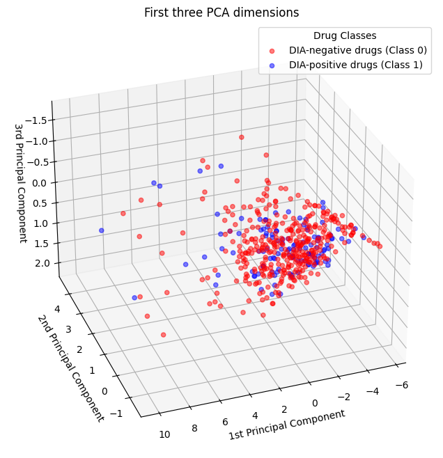
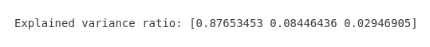
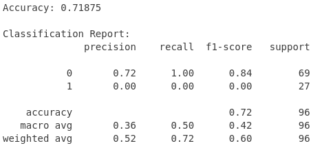

# 📊 Principal Component Analysis (PCA) on Drug Induced Autoimmunity Prediction

This task is to implement a dimensionality reduction algorithm, namely **Principal Component Analysis (PCA)**, to simplify the data and reduce complexity so that training a model becomes easier.  The data used in this task is the **Drug Induced Autoimmunity Prediction** dataset, which can be obtained through the following link: 

[https://archive.ics.uci.edu/dataset/1104/drug_induced_autoimmunity_prediction](https://archive.ics.uci.edu/dataset/1104/drug_induced_autoimmunity_prediction).

After the data is processed using the PCA algorithm, the next step is to train a **Logistic Regression** model based on the data that has been processed.

## 1. Loading Data
```python
# Load the data
file_path = "/home/uta/Coding/Machine Learning/DIA_trainingset_RDKit_descriptors.csv"
data = pd.read_csv(file_path)

# Preprocess the data
data = data.dropna(subset=["Label"])  # Drop rows where the target (Label) is missing
X = data[["BalabanJ", "BertzCT", "Chi0", "Chi0n", "Chi0v", "Chi1", "Chi1n", "Chi1v"]]  # Features
y = data["Label"]  # Target

# Standardize the features (important for PCA)
scaler = StandardScaler()
X_std = scaler.fit_transform(X)
```
First, the data to be analyzed is loaded from the location where the data is stored. Then, the data is separated into two variables: **X (Features)** and **y (Target)**. The data to be processed is then standardized in preparation for PCA processing.

## 2. PCA Algorithm Application
```python
# Apply PCA with 3 components
pca = PCA(n_components=3)  # Reduce to 3 dimensions
X_pca = pca.fit_transform(X_std)
```
The data dimensions are then reduced into a 3-dimensional form. The result of the data transformation is stored in the variable **X_pca**. The result from this PCA algorithm is then visualized using the following code.

```python
# Visualize the PCA results in 3D
fig = plt.figure(figsize=(10, 8))
ax = fig.add_subplot(111, projection="3d", elev=-150, azim=110)

# Scatter plot for Class 0 (DIA-negative drugs) and Class 1 (DIA-positive drugs)
scatter = ax.scatter(
    X_pca[y == 0, 0],  # Principal Component 1 for Class 0
    X_pca[y == 0, 1],  # Principal Component 2 for Class 0
    X_pca[y == 0, 2],  # Principal Component 3 for Class 0
    color="red",
    label="DIA-negative drugs (Class 0)",
    alpha=0.5,
)
scatter = ax.scatter(
    X_pca[y == 1, 0],  # Principal Component 1 for Class 1
    X_pca[y == 1, 1],  # Principal Component 2 for Class 1
    X_pca[y == 1, 2],  # Principal Component 3 for Class 1
    color="blue",
    label="DIA-positive drugs (Class 1)",
    alpha=0.5,
)

# Set labels and title
ax.set(
    title="First three PCA dimensions",
    xlabel="1st Principal Component",
    ylabel="2nd Principal Component",
    zlabel="3rd Principal Component",
)

# Add a legend
ax.legend(loc="upper right", title="Drug Classes")

# Show the plot
plt.show()
```


From the graph, it can be seen that the two classes tend to form separate clusters, although there are some areas where the two classes overlap. This indicates that PCA has successfully captured most of the variance in the data, making it possible to distinguish between the two classes. The variance ratio for each Principal Component (PC) can be obtained using the following code.

```python
# Print explained variance ratio
explained_variance = pca.explained_variance_ratio_
print("Explained variance ratio:", explained_variance)
```


Based on the obtained variance ratios, it is known that **PC1** consists of the majority of the variance (87.65%), while **PC2** and **PC3** contribute smaller portions of the information (8.45% and 2.95%, respectively). With a total of these three components accounting for **99.05%** of the dataset's information, this shows that PCA is an effective dimensionality reduction technique.

## 3. Logistic Regression
After the data has been processed using the PCA algorithm, the data is then trained using a logistic regression model, as shown in the following code.
```python
# Logistic Regression
X_train, X_test, y_train, y_test = train_test_split(X_pca, y, test_size=0.2, random_state=42)
model = LogisticRegression()  
model.fit(X_train, y_train)
y_pred = model.predict(X_test)
```
Finally, the trained model is evaluated to determine its performance.
```python
# Evaluate the model
accuracy = accuracy_score(y_test, y_pred)
print("Accuracy:", accuracy)
print("\nClassification Report:")
print(classification_report(y_test, y_pred, zero_division=0))
```


The evaluation results of the Logistic Regression model show that the model has an accuracy of **71.875%**, which means the model can correctly predict the target class in approximately **71.875%** of the total test data. However, this result needs to be examined in more detail through a **classification report**. In the classification report, it can be seen that the model performs very differently for the two classes.  

For **Class 0**, the model shows a **precision of 0.72**, **recall of 1.00**, and an **F1-score of 0.84**, indicating good performance in identifying all instances of Class 0. However, for **Class 1**, the model completely fails with precision, recall, and F1-score all at **0.00**, meaning the model did not successfully predict any Class 1 instances correctly. This imbalance in performance is also reflected in the **macro average** and **weighted average**. The macro average for precision, recall, and F1-score are **0.36**, **0.50**, and **0.42**, respectively, while the weighted averages are **0.52**, **0.72**, and **0.60**. This shows that the model tends to be biased toward **Class 0** and fails to recognize **Class 1**. Overall, although the accuracy appears quite good, this model is not effective for predicting **Class 1**. Therefore, improvements are needed, such as handling **imbalanced data**, **hyperparameter tuning**, or using other algorithms that may be more suitable for this dataset.

